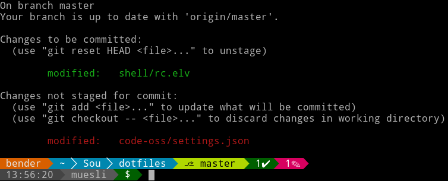

# elvish-libs
Libs & Themes for [elvish](https://github.com/elves/elvish)

## Install

Make sure you run elvish 0.11 or newer. Install this module by running the
following commands in your shell:

```
use epm
epm:install github.com/muesli/elvish-libs
```

## Themes

### powerline



To use the `powerline` theme, put this code in your `~/.elvish/rc.elv`:

```
use github.com/muesli/elvish-libs/theme/powerline
powerline:setup
```

## Modules

### git

The `git` module provides convenient elvish functions to extract stats from a
git repository. It lets you query the repo how many commits you are ahead or
behind of master and how many files have been changed or added to it.

Enjoy!
